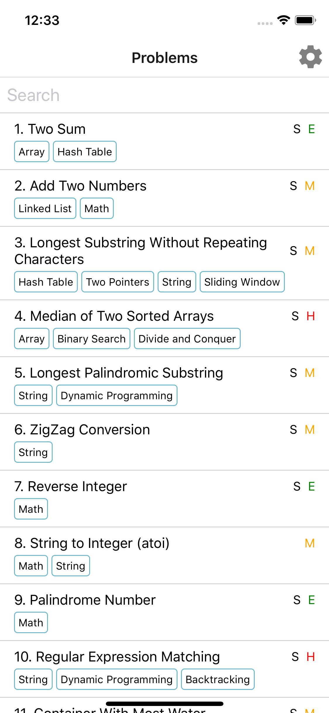
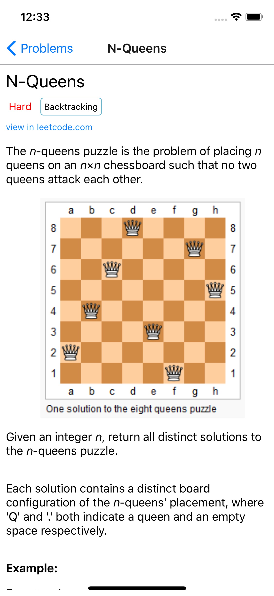
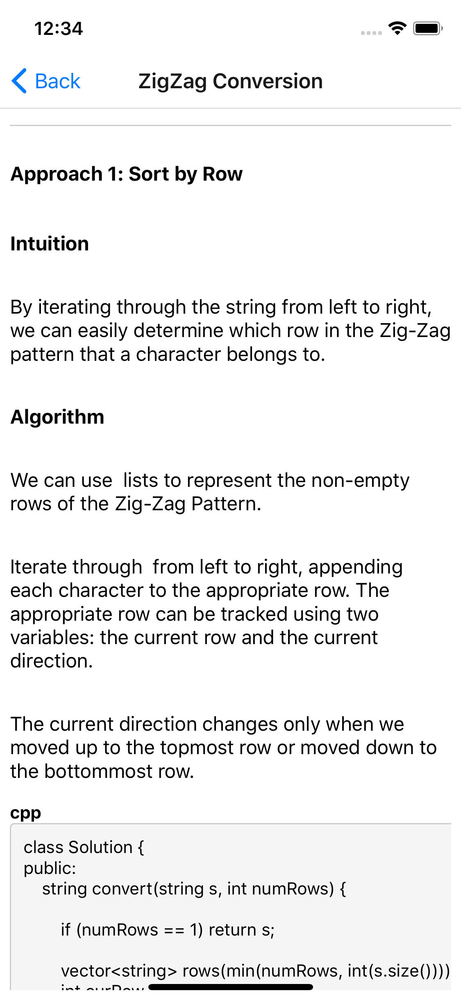

# leetcode-mobile

WIP Leetcode mobile app, written with React Native and powered by Expo.

<div style='display: inline-flex;background-color: #d2d2d2;'>



</div>


### Environment:

```
$ npm install -g expo-cli
$ cd lc
$ expo start
```
